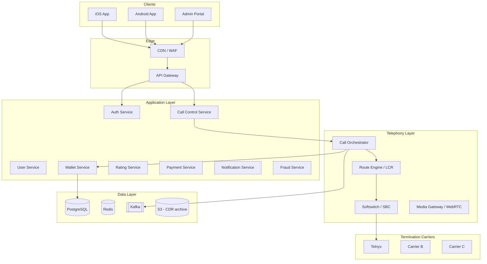
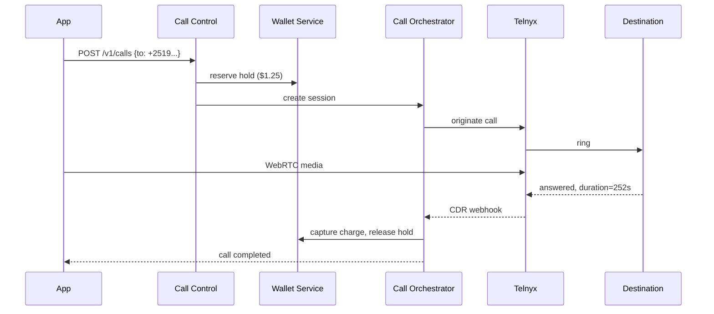

# System Design Document
## International Calling Platform (Boss Revolution–style)

**Version:** 1.0  
**Scope:** Prepaid international calling app with multi-carrier routing  
**Primary corridors (initial):** US/EU → Ethiopia, Kenya, East Africa

---

## 1. Executive summary

This platform lets users:

1. Create an account and top up a prepaid wallet
2. Dial international phone numbers from a mobile app
3. Connect calls through a telephony core that selects the best carrier route
4. Be billed per minute based on destination and call duration

The system is designed as a **modular, cloud-native architecture** that starts with a managed CPaaS (Telnyx) for MVP and evolves to a **multi-carrier SIP softswitch** at scale.

---

## 2. Goals and non-goals

### Goals

- Support **app-to-PSTN** international calling
- Route calls across **multiple termination carriers**
- Provide **prepaid wallet billing** with transparent rates
- Support **top-up** via card and mobile money (telebirr, M-PESA)
- Maintain **CDR-based billing** with audit trail
- Enable **quality-based failover** between carriers

### Non-goals (MVP)

- Direct API integration with Ethio Telecom / Safaricom (phase 3)
- Money transfer / remittance
- In-app messaging
- Own mobile network infrastructure
- Full contact center / IVR product

---

## 3. High-level architecture



---

## 4. Core components

| Component | Responsibility |
|-----------|----------------|
| **Mobile app (Flutter)** | Auth UI, dialer, wallet, WebRTC/SIP client, call history |
| **API Gateway** | JWT validation, rate limiting, TLS |
| **Auth service** | Phone OTP, JWT tokens, device registration |
| **User service** | Profile, KYC status, preferences |
| **Wallet service** | Prepaid ledger (double-entry), holds, top-ups |
| **Rating service** | Prefix-based rate lookup, billing increments |
| **Call control service** | Validate destination, create sessions, expose status |
| **Call orchestrator** | Originate calls, process CDR, finalize billing |
| **Route engine (LCR)** | Least-cost routing, quality failover |
| **Payment service** | Stripe, M-PESA, telebirr webhooks |
| **Fraud service** | Velocity limits, prefix blocks, spend caps |
| **Admin portal** | Rates, carriers, CDR search, manual adjustments |

---

## 5. Call flow (outbound app-to-PSTN)



---

## 6. Billing logic

### Pre-call

1. Normalize destination to E.164
2. Lookup retail rate by longest matching prefix
3. Place wallet **hold** (e.g. 5 minutes worth)

### Post-call

```
billable_seconds = ceil(duration / increment) * increment
charge = (billable_seconds / 60) * retail_rate
capture min(charge, held_amount)
release remaining hold
```

---

## 7. Data model (summary)

Core entities: `users`, `wallets`, `wallet_transactions`, `destination_rates`, `carriers`, `carrier_routes`, `calls`, `cdrs`, `topups`.

See [database/migrations/001_initial_schema.sql](database/migrations/001_initial_schema.sql) for full DDL.

---

## 8. Security

| Area | Control |
|------|---------|
| Transport | TLS 1.2+ everywhere |
| Auth | JWT + refresh rotation |
| Payments | Stripe-hosted checkout only |
| Telephony creds | Never in mobile app; backend-only |
| Wallet | Immutable double-entry ledger |
| Fraud | Rate limits, prefix blacklists, spend caps |

---

## 9. Compliance (Ethiopia / East Africa)

- Commercial voice termination may require **licensing / operator partnership**
- KYC/AML for prepaid wallets
- Sanctions screening and premium-number blocking
- Legal review per launch country before production

---

## 10. Deployment (AWS MVP)

- **Compute:** ECS/Fargate
- **DB:** RDS PostgreSQL
- **Cache:** ElastiCache Redis
- **Events:** MSK Kafka
- **Secrets:** AWS Secrets Manager
- **Observability:** CloudWatch + structured logs

---

## 11. Roadmap

| Phase | Scope |
|-------|-------|
| **Phase 1 (MVP)** | Single carrier (Telnyx), Stripe, Flutter app |
| **Phase 2** | Multi-carrier LCR, M-PESA/telebirr, fraud rules |
| **Phase 3** | Operator interconnect, own softswitch, multi-region |

---

## 12. Related documents

- [OpenAPI spec](api/openapi.yaml)
- [Telnyx integration](telephony/telnyx-integration.md)
- [Database schema](database/migrations/001_initial_schema.sql)
- [Sprint plan](sprint-plan.md)
