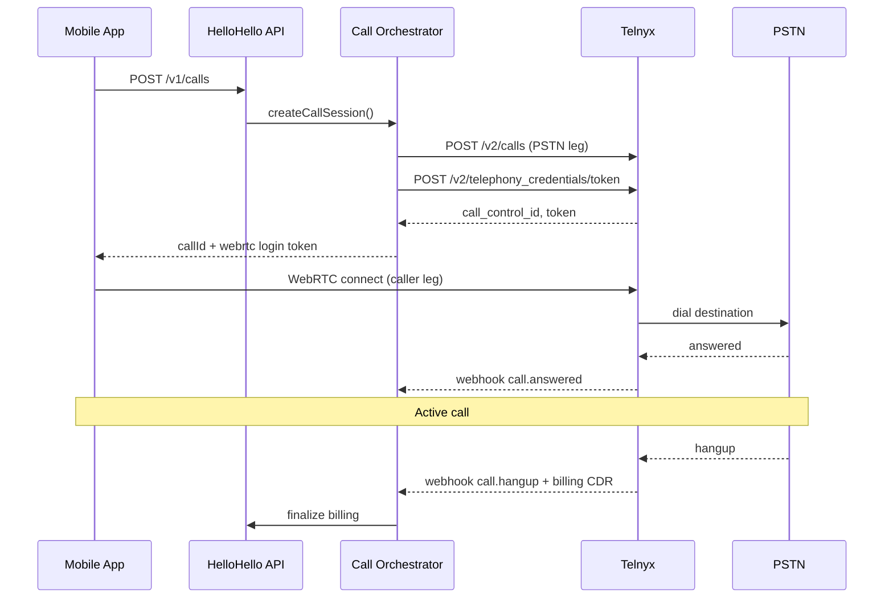

# Telnyx Telephony Integration Spec

**Version:** 1.0  
**Scope:** MVP call origination, WebRTC client connection, CDR webhooks, billing reconciliation

---

## 1. Overview

HelloHello uses **Telnyx** as the primary termination carrier for MVP. The backend:

1. Creates an outbound call leg to the destination PSTN number
2. Issues a WebRTC credential to the mobile app for the caller leg
3. Bridges caller media to the PSTN leg
4. Receives Telnyx webhooks for call state and billing
5. Finalizes wallet charges from CDR data

**Telnyx docs:** https://developers.telnyx.com/

---

## 2. Prerequisites

| Item | Notes |
|------|-------|
| Telnyx account | Production + mission control access |
| API key | Stored in AWS Secrets Manager |
| Connection | SIP or Credential connection for outbound |
| Outbound voice profile | Permitted destinations (+251, +254, etc.) |
| Webhook URL | `https://api.hellohello.app/v1/webhooks/telnyx` |
| WebRTC credential connection | For mobile app media |
| Verified CLI | Optional outbound caller ID |

---

## 3. Architecture



---

## 4. Environment configuration

```bash
TELNYX_API_KEY=KEYxxxxxxxx
TELNYX_CONNECTION_ID=1234567890
TELNYX_WEBRTC_CONNECTION_ID=0987654321
TELNYX_WEBHOOK_SECRET=whsec_xxx
TELNYX_DEFAULT_CLI=+12025550100
TELNYX_API_BASE=https://api.telnyx.com/v2
```

---

## 5. Call origination flow

### 5.1 Internal steps (Call Orchestrator)

```
1. Validate E.164 destination
2. Lookup retail rate (+251, +254 prefix)
3. Reserve wallet hold (default: 5 min × rate)
4. Create internal call record (status=initiated)
5. Originate PSTN leg via Telnyx
6. Issue WebRTC token for app
7. Return CallSession to client
```

### 5.2 Originate PSTN leg

**Request**

```http
POST https://api.telnyx.com/v2/calls
Authorization: Bearer {TELNYX_API_KEY}
Content-Type: application/json
```

```json
{
  "connection_id": "{TELNYX_CONNECTION_ID}",
  "to": "+251911234567",
  "from": "+12025550100",
  "client_state": "base64-encoded-json",
  "timeout_secs": 60,
  "webhook_url": "https://api.hellohello.app/v1/webhooks/telnyx",
  "webhook_url_method": "POST"
}
```

**`client_state` payload (base64 JSON before encoding)**

```json
{
  "callId": "550e8400-e29b-41d4-a716-446655440000",
  "userId": "7c9e6679-7425-40de-944b-e07fc1f90ae7",
  "retailRatePerMin": 0.25,
  "wholesaleRatePerMin": 0.18,
  "currency": "USD",
  "holdTransactionId": "hold-uuid"
}
```

**Response (simplified)**

```json
{
  "data": {
    "call_control_id": "v3:abc123",
    "call_leg_id": "leg-xyz",
    "is_alive": true
  }
}
```

Store `call_control_id` on the internal `calls` row as `carrier_call_id`.

### 5.3 Issue WebRTC credential for mobile app

Use Telnyx Telephony Credentials API to generate a short-lived token for the Flutter WebRTC client.

```http
POST https://api.telnyx.com/v2/telephony_credentials/token
Authorization: Bearer {TELNYX_API_KEY}
Content-Type: application/json
```

```json
{
  "connection_id": "{TELNYX_WEBRTC_CONNECTION_ID}",
  "expires_in": 3600
}
```

Return token to app in `TelephonyCredentials.loginToken`.

### 5.4 Bridge caller leg (option A — recommended MVP)

**Pattern:** App connects via WebRTC → backend bridges to existing PSTN `call_control_id`.

When app signals ready:

```http
POST https://api.telnyx.com/v2/calls/{call_control_id}/actions/bridge
Authorization: Bearer {TELNYX_API_KEY}
Content-Type: application/json
```

```json
{
  "call_control_id": "{webrtc_leg_call_control_id}"
}
```

### 5.5 Hangup

```http
POST https://api.telnyx.com/v2/calls/{call_control_id}/actions/hangup
Authorization: Bearer {TELNYX_API_KEY}
```

Also triggered when:
- User taps hang up in app
- Wallet balance exhausted
- Fraud rule triggers force terminate

---

## 6. Webhook handling

### 6.1 Endpoint

```
POST /v1/webhooks/telnyx
```

### 6.2 Security

1. Verify Telnyx webhook signature (Ed25519 public key from Telnyx portal)
2. Reject stale events (> 5 min old)
3. Idempotency key = `{event_type}:{event_id}` stored in Redis (TTL 24h)

### 6.3 Events to handle

| Event | Action |
|-------|--------|
| `call.initiated` | Update call status → `initiated` |
| `call.ringing` | Update status → `ringing` |
| `call.answered` | Set `answered_at`, status → `answered` |
| `call.hangup` | Set `ended_at`, compute duration, finalize billing |
| `call.machine.detection.ended` | Optional: mark as voicemail if detected |
| `call.cost` | Store wholesale cost for margin reporting |

### 6.4 Sample webhook payload

```json
{
  "data": {
    "event_type": "call.hangup",
    "id": "evt_01HXYZ",
    "occurred_at": "2026-06-14T18:22:11.000Z",
    "payload": {
      "call_control_id": "v3:abc123",
      "call_leg_id": "leg-xyz",
      "client_state": "eyJjYWxsSWQiOiIuLi4ifQ==",
      "hangup_cause": "normal_clearing",
      "hangup_source": "caller",
      "start_time": "2026-06-14T18:18:00.000Z",
      "end_time": "2026-06-14T18:22:12.000Z",
      "sip_hangup_cause": "200"
    }
  },
  "meta": {
    "attempt": 1,
    "delivered_to": "https://api.hellohello.app/v1/webhooks/telnyx"
  }
}
```

### 6.5 Webhook processing pseudocode

```python
def handle_telnyx_webhook(event):
    verify_signature(request)
    if is_duplicate(event.id):
        return 200

    payload = event.data.payload
    call_ctx = decode_client_state(payload.client_state)
    call = db.get_call(call_ctx.callId)

    if event.data.event_type == "call.answered":
        call.status = "answered"
        call.answered_at = event.occurred_at
        db.save(call)

    elif event.data.event_type == "call.hangup":
        duration_sec = seconds_between(payload.start_time, payload.end_time)
        charge = rating.compute_charge(call_ctx.retailRatePerMin, duration_sec)
        wallet.capture(call_ctx.holdTransactionId, charge)
        call.status = "completed"
        call.duration_sec = duration_sec
        call.billed_amount = charge
        call.ended_at = payload.end_time
        db.save(call)
        cdr.store(raw=event, call_id=call.id)
        publish("call.completed", call)

    return 200
```

---

## 7. CDR and billing reconciliation

### 7.1 Primary billing source

**MVP:** Use `call.hangup` webhook timestamps for billable duration.

**Production:** Reconcile daily against Telnyx CDR export / `call.cost` events.

### 7.2 Billing formula

```
billable_seconds = ceil(talk_duration_sec / billing_increment_sec) * billing_increment_sec
charge = (billable_seconds / 60.0) * retail_rate_per_min
final_charge = min(charge, held_amount)
release_amount = held_amount - final_charge
```

### 7.3 Failed / unanswered calls

| hangup_cause | Billing |
|--------------|---------|
| `normal_clearing` with talk time > 0 | Bill talk time |
| `no_answer` | No charge, release full hold |
| `user_busy` | No charge, release full hold |
| `call_rejected` | No charge, release full hold |
| Duration = 0 | No charge |

### 7.4 Daily reconciliation job

```
For each completed call in last 24h:
  internal_cdr = db.cdrs.find(call_id)
  telnyx_cdr = telnyx_api.fetch_detail(call.carrier_call_id)
  if abs(internal.duration - telnyx.duration) > 2 sec:
    alert_ops(call_id, mismatch)
  if abs(internal.wholesale_cost - telnyx.cost) > $0.01:
    alert_finance(call_id)
```

---

## 8. Error handling and retries

| Scenario | Behavior |
|----------|----------|
| Telnyx 5xx on originate | Retry once, then fail call + release hold |
| Webhook delivery failure | Telnyx retries; idempotent handler |
| App WebRTC connect timeout (30s) | Hangup PSTN leg, release hold |
| Insufficient wallet mid-call | Send hangup to both legs at next heartbeat |
| Invalid destination | Fail before Telnyx call; no hold placed |

---

## 9. Testing

### 9.1 Sandbox

- Use Telnyx test numbers and sandbox API key
- Simulate webhooks with Telnyx webhook debugger

### 9.2 Test matrix

| Test | Expected |
|------|----------|
| Call +251 mobile, answered 60s | Wallet debited ~1 min × rate |
| No answer | Hold released, $0 charge |
| Hangup at 5s | Bill 1 increment (if 60s increment) |
| Duplicate hangup webhook | Single charge only |
| Insufficient balance | 402 before originate |

### 9.3 Manual webhook test

```bash
curl -X POST https://api.staging.hellohello.app/v1/webhooks/telnyx \
  -H "Content-Type: application/json" \
  -H "Telnyx-Signature-Ed25519: ..." \
  -d @fixtures/telnyx-call-hangup.json
```

---

## 10. Observability

### Metrics

- `telnyx_calls_originated_total{destination_prefix}`
- `telnyx_call_setup_duration_seconds`
- `telnyx_webhook_events_total{event_type}`
- `telnyx_webhook_processing_errors_total`
- `call_asr_ratio{prefix}` (answered / attempted)
- `billing_reconciliation_mismatch_total`

### Logs (structured)

```json
{
  "callId": "uuid",
  "carrierCallId": "v3:abc123",
  "eventType": "call.hangup",
  "durationSec": 252,
  "charge": 1.05,
  "destination": "+251911234567"
}
```

---

## 11. Phase 2: multi-carrier abstraction

Define internal interface so Telnyx can be swapped/augmented:

```typescript
interface TelephonyProvider {
  originateCall(req: OriginateRequest): Promise<OriginateResponse>;
  hangup(carrierCallId: string): Promise<void>;
  issueClientCredentials(userId: string): Promise<ClientCredentials>;
  verifyWebhook(req: Request): WebhookEvent;
}
```

Implementations: `TelnyxProvider`, `CarrierBProvider`.

Route engine selects provider before `originateCall()`.

---

## 12. References

- [Telnyx Call Control API](https://developers.telnyx.com/docs/api/v2/call-control)
- [Telnyx WebRTC](https://developers.telnyx.com/docs/voice/webrtc)
- [Telnyx Webhooks](https://developers.telnyx.com/docs/voice/programmable-voice/voice-api-webhooks)
- [HelloHello OpenAPI](../api/openapi.yaml)
- [Database schema](../database/migrations/001_initial_schema.sql)
